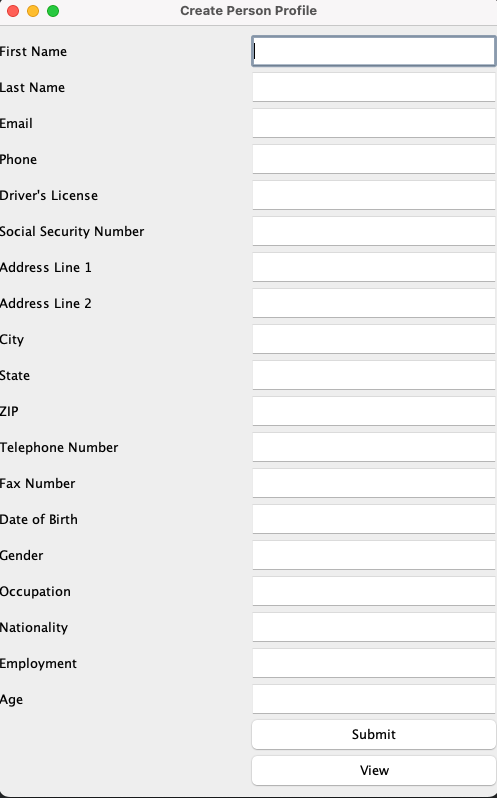
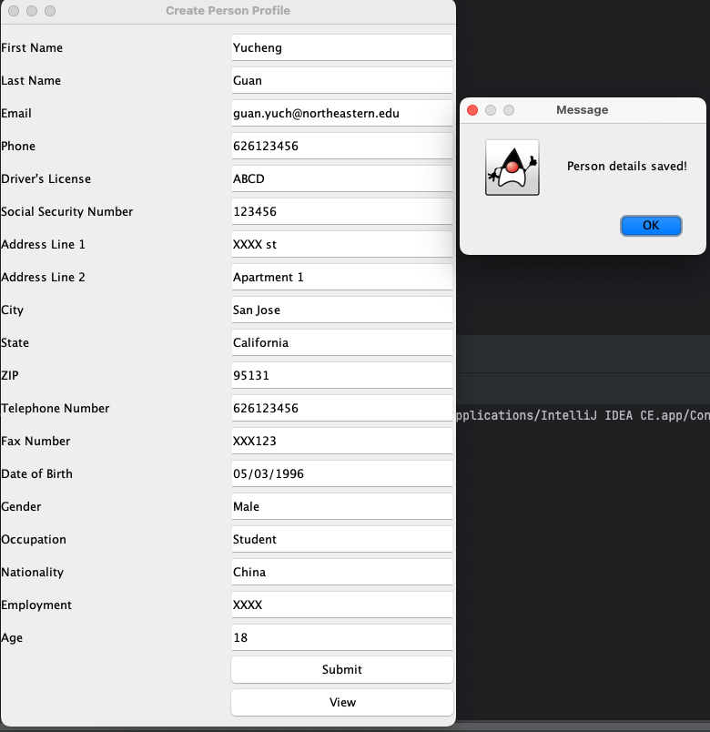
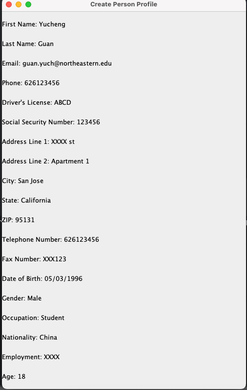

# Yucheng_Guan_002331781_assignments
Person.java is to have all the attributes of a person.

CreatePersonPanel.java is to take all user inputs and create a Person object to save the data.

ViewPersonPanel.java is to display the person profile to user.

PersonMain.java is to handle the JFrame and panel management, also you should run this file to start our program.

CreatePerson Panel

After writing all the attributes, click on submit:

After clicking on view, show person's profile:

